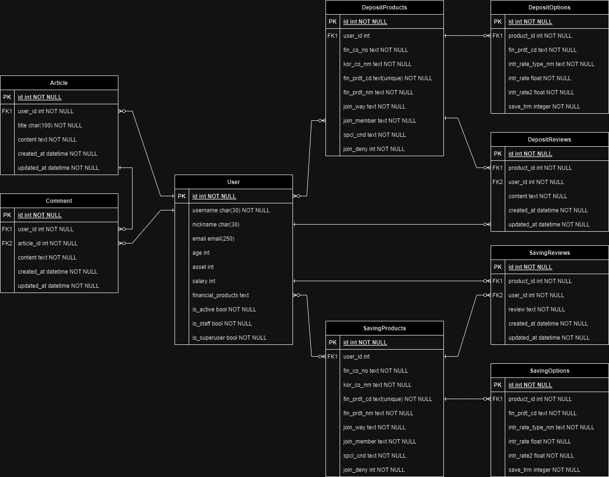
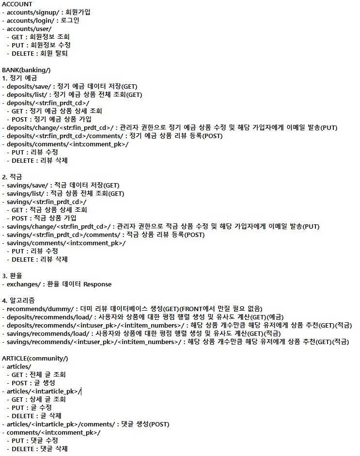

# final-pjt

## 역할 분담

- 이지호 : BackEnd(DRF)

  - 세부 역할
    - 회원 커스터마이징을 위한 User Model 구현
    - 금융 상품 데이터 저장 및 조회 기능 구현
    - 금융 상품 리뷰 기능 구현
    - 환율 데이터 요청 및 전송
    - 커뮤니티 기능을 위한 글, 댓글 Model 구현
    - 금융 상품 추천 알고리즘 구현

- 정태윤 : FrontEnd(Vue)
  - 세부 역할
    - 메인 페이지 구현
    - 계정 관리, 프로필 페이지 구현
    - 금융 상품 전체 조회 및 상세 조회 페이지 구현
    - 환율 데이터 출력
    - 근처 은행 정보 API 이용하여 정보 출력
    - 커뮤니티 페이지 구현
    - 상품 추천 페이지 구현

## 전체 일정

- 11/16(목)
  - Front
    - URL, View, Component 파일 기본 틀 구성
    - Navbar, 회원가입, 로그인 UI 제작
  - Back
    - 데이터베이스 모델링 구성 및 ERD 제작
    - 회원 커스터 마이징 기능 구현
- 11/17(금)
  - Front
    - 메인 / 금융 상품 비교 / 커뮤니티 페이지 UI 제작 및 개발
  - Back
    - 금융 상품 모델 설계 및 API 이용하여 DB에 저장
    - 금융 상품 전체 조회 / 상세 조회 / 리뷰 기능 구현
    - 환율정보 API 이용하여 데이터 받아오기 / 프론트에 전송
    - 커뮤니티 기능 구현을 위한 글, 댓글 Model 설계
    - 글, 댓글 생성 / 조회 / 수정 / 삭제 기능 구현
- 11/20(월)
  - Front
    - 게시판 삭제 및 댓글 생성 / 삭제 개발
  - Back
    - 금융 상품 추천 알고리즘 구현
- 11/21(화)
  - Front
    - 적금상품 비교 및 예금 / 적금 상세 정보 개발
  - Back
    - 금융 상품 추천 알고리즘 검증
    - 금리 정보 수정 기능 및 메일 전송 기능 구현
- 11/22(수)
  - Front
    - 환율 계산, 지도 개발
  - Back
    - 전체 기능 검증 및 오류 수정
- 11/23(목)
  - 여유될 때 추가 기능 구현 예정
  - 발표 자료 제작

## 1일차(2023-11-16)

### Back

- 데이터베이스 모델링(ERD)

  - 우선 모든 서비스의 기본이 되는 User Model을 중심으로 User Model과 1:N 관계를 가지는 예금 모델, 적금 모델을 설정하였고, 예/적금 모델과 1:N 관계를 가지는 예/적금 옵션 모델을 추가적으로 설정하였습니다. 또한, 예/적금 상세 조회 페이지에서 해당 상품에 대한 리뷰 기능을 구현하기 위해 예/적금 모델 및 User Model과 1:N 관계를 가지는 Review 모델 또한 설정하였습니다.
  - 근처 은행 검색 기능을 구현하기 위해 Bank Model을 구현하였습니다.
  - 커뮤니티 기능을 구현하기 위해 Article, Comment Model을 추가적으로 구현하였습니다.
    

- 회원 커스터마이징 기능 구현
  - 필수 요구사항 중 회원 커스터마이징 기능을 구현하였습니다.
  - 회원 관리 라이브러리인 allauth와 dj-rest-auth를 이용하여 기본 User Model을 상속받아 커스텀 User Model과 Serializer를 구성하였습니다.
  - 추가 field로 유저의 닉네임에 해당하는 nickname, 유저의 나이에 해당하는 age, 유저의 자산에 해당하는 asset, 유저의 연봉에 해당하는 salary, 유저가 가입한 상품 목록인 financial_products field를 생성하였습니다.
  - 또한, 회원 정보 확인 / 수정 / 탈퇴 기능을 나누어 구현하기 위해 url에 해당하는 view 함수의 method를 GET, PUT, DELETE로 나누었습니다.
  - method가 GET일 경우에는 유저의 모든 정보를 확인할 수 있도록 User model의 모든 Field를 확인할 수 있는 Serializer를 통해 해당 유저의 정보를 출력할 수 있도록 구현하였습니다.
  - method가 PUT일 경우에는 수정 가능한 정보만 수정할 수 있도록, 별도의 Serializer를 통해 수정할 수 있는 필드를 지정해준 다음, 모든 정보가 아닌 일부분의 정보만 수정해도 제출이 가능하도록 partial=True 인자를 추가하여 view 함수를 구현하였습니다.
  - method가 DELETE인 경우에는 회원 탈퇴가 가능하도록 delete() 함수를 이용하여 view 함수를 구현하였습니다.

## 2일차(2023-11-17)

### Back

- 금융 상품 데이터 저장 및 조회
  - 금융상품통합비교공시 API를 이용하여 정기 예금 및 적금 데이터를 받아와 DB에 저장하였습니다.
  - 전체 상품 목록, 해당 상품에 대한 상세 상품 목록을 확인할 수 있도록 Model을 설계하고, View 함수를 구현하였습니다.
  - 해당 상품에 대한 리뷰 기능을 구현할 수 있도록 Review Model을 설계하고, 댓글을 작성 및 수정, 삭제할 수 있는 View 함수를 구현하였습니다.
- 환율 데이터 요청 및 전송
  - 한국수출입은행 환율정보 API를 이용하여 데이터를 받아온 이후 JSON 형식으로 출력할 수 있도록 View 함수를 구현하였습니다.
- 커뮤니티 기능 구현
  - 글, 댓글 Model을 구현하고, 게시글 및 댓글 조회, 생성, 삭제, 수정 기능을 구현할 수 있도록 이에 해당하는 URL과 View 함수를 구현하였습니다.
- URL
  

### Front

- 로그인, 회원가입 기능 구현
  - 회원가입 후 자동 로그인이 가능하다.
- 게시글 조회 및 생성 기능 구현
  게시글 클릭 시 해당 게시글의 상세 페이지로 이동한다.
- 메인 페이지 인기 예금, 적금 조회
  - 메인 페이지에 가입자가 많은 상위 4개의 예금, 적금 조회 및 더보기 클릭 시 예금적금 비교 페이지로 이동

## 3일차(2023-11-20)

### Back

- 금융 상품 추천 알고리즘 구현

  - Item-Based Collaborative Filtering을 이용한 알고리즘을 구현하였습니다.
  - Item-Based Collaborative Filtering 알고리즘은 사용자의 행동 패턴을 분석하여, 사용자가 아직 평가하지 않은 아이템 중에 사용자가 선호할 만한 아이템을 찾아내는 방법입니다.
  - 이를 위해 각 금융 상품 모델 필드에 Integer 타입의 Review 필드를 추가하여 사용자가 가입한 상품을 평가할 수 있는 기능을 구현하여 이를 기반으로 알고리즘을 구현하였습니다.
  - 또한, 사용자가 아직 아무런 아이템도 평가하지 않았거나, 모든 아이템의 유사도가 0일 경우에는 대신 인기도가 가장 높은 아이템 순서로 추천하는 로직을 추가하였습니다.

- 금융 상품 가입 기능 구현

  - 기존 금융 상품 상세 정보를 확인하는 view 함수에서 POST Method를 추가하여 사용자가 상품을 가입할 수 있도록 하였습니다.
  - 또한 이미 가입한 상품일 경우, 사용자가 가입을 취소할 수 있도록 하는 기능도 추가적으로 구현하였습니다.

- 관리자 권한으로 수정 및 메일 전송 기능 구현

  - view 함수를 추가하여 decorator를 통해 관리자일 경우에만 금리 정보를 수정할 수 있도록 구현하였습니다.
  - 또한, django.core.mail 모듈과 네이버 호스트 서버를 이용하여 금리 정보가 수정될 경우 가입한 유저의 이메일로 수정 정보가 전송되도록 구현하였습니다.

- 정리
  - 예상보다 오늘 구현하고자 하는 기능 구현이 수월하게 되어 내일은 알고리즘 최종 검증 및 다른 방법을 이용한 알고리즘 구현, 전체적인 view, url, models, serializer 점검 및 오류 수정, 디테일한 기능을 구현할 예정입니다.

## 4일차(2023-11-21)

### Back

- 유저 모델 필드 수정
  - 유저가 가입한 상품 목록을 TextField로 저장했을 때, 이후에 이를 이용하는 로직을 구현할 때 불편함이 있어, TextField에서 JSONField로 변경하여 가입한 상품의 모든 정보가 다 저장될 수 있도록 하였습니다.
- 금융 상품 가입 Model 구현
  - 사용자가 상품을 가입할 때, 금액과 가입 개월 수를 입력했을 때, 이를 이용하여 현재 날짜를 기반으로 만기일을 자동으로 계산하고, 이를 개별 Model로 저장하기 위해 가입 관련 DB를 저장할 수 있는 Model을 추가적으로 구현했습니다.
- 알고리즘 추가

  - 기존 Item-based Collaborative Filter 알고리즘에 더해 사용자의 나이대, 직업, 자산, 연봉 정보를 이용하여 필터링을 통해 비슷한 나이대 / 자산 / 연봉 혹은 같은 직업대의 사람들이 가장 많이 가입한 상품을 추천하는 기능을 추가적으로 구현할 수 있도록 알고리즘을 추가하였습니다.

- 정리
  - 오늘부로 필수적으로 구현해야 하는 기능과 도전과제까지 Backend에서 해야할 설계는 거의 마무리되었습니다. 내일은 Frontend와 같이 기능을 검증하면서 오류가 발생했을 때 수정을 하고, 추가 기능이 필요하면 구현할 예정입니다.
